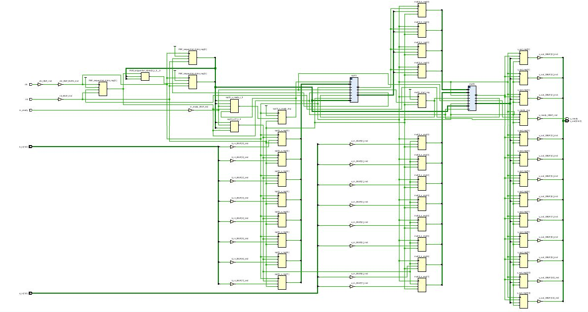
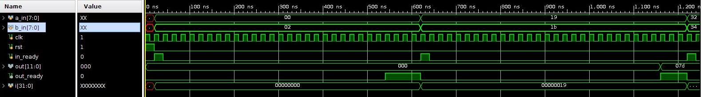
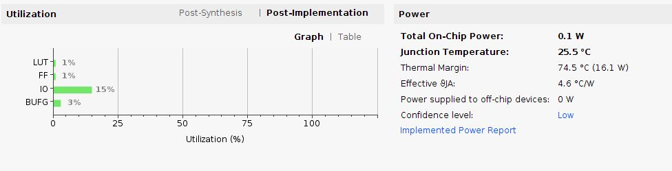
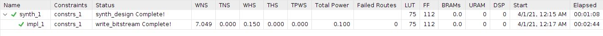

<!-- федеральное государственное автономное образовательное учреждение высшего образования
«Национальный исследовательский университет ИТМО» -->

# Лабораторная работа №3 &laquo;Функциональная схемотехника&raquo;

Выполнили студенты группы P33113:  Доморацкий Э.А., Юров М.А.

Преподаватель: Тищук Б.Ю.

Санкт-Петербург, 2021

Цель работы
=======

Получить навыки разработки цифровых устройств на базе программируемых логических интегральных схем (ПЛИС).

Схема портов ввода/вывода
=======================

Алгоритм работы пользователя
===========================

1. Пользователь нажимает на кнопку rst - M17.
2. Побитово вводятся значения операндов на ползунковые переключатели.
3. Пользователь нажимает на кнопку in_ready - P17.
4. Результат вычислений выводится на светодиодах.
5. Для повторных вычислений повторяются шаги 2-4.

Код исходной схемы
========================

Репозиторий: https://github.com/theotheruser2/schemelab3  

`sqrt.v` - блок вычисления квадратного корня\
`a_sqrtb.v` - схема для вычисления значения функции\
`multiplier.v` - блок умножения

Код разработанного тестового окружения 
=======================================

`ab_tb.v` - тестирование блока вычисления квадратного корня\
`s_test.v` - тестирование работы схемы в целом

Файл ограничений
================

`inoutconst.xdc`

Файл прошивки
=============

`a_sqrtb.bit`

Временная диаграмма
===================

Сигналы подаются с частотой 100 МГц. На рассчёт одного значения уходит 580 нс.

Потребление ресурсов
====================

Полученные на основе симуляции данные об использовании ресурсов устройства, энергопотреблении, температуре:

Вывод
=====

В ходе работы были получены базовые навыки работы с ПЛИС, дискретными портами ввода/вывода, подключенным к отладочной плате.
